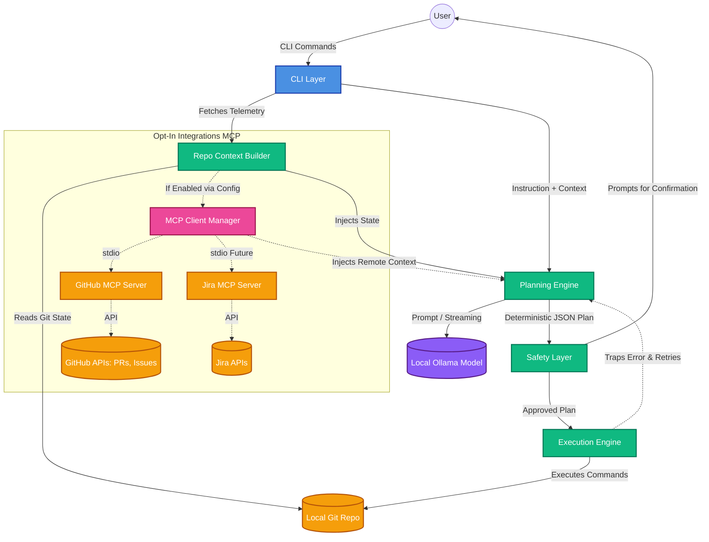

# GitGuide System Architecture

The following diagram outlines the internal architecture of **GitGuide**, illustrating how the local CLI interacts with the deterministic Git Execution Engine, the local AI (Ollama), and the new **opt-in Model Context Protocol (MCP)** integration for tracking remote tools like GitHub and Jira.

## Architecture Diagram

## Module Breakdown

1. **CLI Layer**: The entry point built with `commander.js`. Routes user requests (`do`, `visualize`, `remote-status`, etc.).
2. **Repo Context Builder**: Synchronously gathers local Git state (branches, diffs, staged files).
3. **MCP Client Manager (Opt-in)**: A dynamically loaded wrapper around `@modelcontextprotocol/sdk`. If configured by the user, it launches local npx MCP servers (like `@modelcontextprotocol/server-github`) to fetch remote context such as open issues or pull requests. It fails gracefully if the user opts out.
4. **Planning Engine**: Interfaces securely with local `Ollama` to synthesize the context and the user's intent into a strict JSON execution plan. Now supports real-time streaming.
5. **Safety Layer**: Visualizes the AI's plan via `inquirer.js` to ensure destructive commands are reviewed.
6. **Execution Engine**: Deterministically executes the JSON plan step-by-step against the local Git binary.
